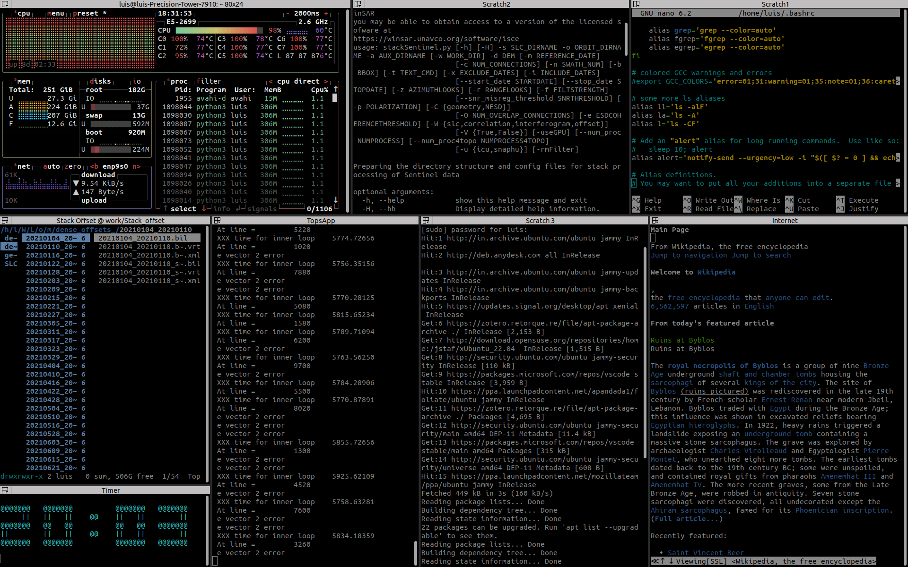

# Timer clock
Introducing a mighty small python app for those who sit for long time in front of computers. We tend to forget to stand up and do some stretch while sitting for long hours, especially in case of serious involvement. This application can help you overcome the issue by showing a live timer on your screen.
This app will be specifically useful for those who use terminal a lot since it runs inside the terminal. 

**sample**

